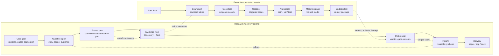

HAI-Pipe One-Slide Workflow
===========================

Status: draft (2026-06-23)
Purpose: fastest visual explanation of how HAI-Pipe is designed.


Core Message
============

HAI-Pipe is not just a data pipeline. It is an evidence-to-delivery workflow:

```
Narrative steers -> Probe judges -> Discovery + Task produce evidence
                 -> Insight synthesizes -> Paper/Application consumes
```

Under that story layer, task execution can run the concrete ML pipeline:

```
Raw -> SourceSet -> RecordSet -> CaseSet -> AIDataSet -> ModelInstance -> EndpointSet
```

The figure should show both layers at once. If it only shows the second line,
people understand the software as ETL. If it only shows the first line, people
miss that HAI-Pipe produces auditable code, results, models, and endpoints.


Recommended Figure
==================

Use a two-lane horizontal diagram.

```
LANE A: Research / delivery control

User goal
   |
   v
Narrative-open ---> Probe-open ---> Evidence work ---> Probe-post ---> Insight ---> Paper / App / Deck
   story            claim contract   outside + inside   verdict       reusable    delivery artifact
                                    evidence            + caveats     meaning

LANE B: Execution / asset pipeline

Raw data -> SourceSet -> RecordSet -> CaseSet -> AIDataSet -> ModelInstance -> EndpointSet
             standardized temporal    triggered  ML-ready   trained        deployable
             tables       records     cases      splits     model          package
```

Connect the lanes at exactly two points:

```
Probe-open  --defines needed evidence-->  Discovery + Task
Task        --runs / audits pipeline---->  SourceSet ... EndpointSet
Pipeline    --emits metrics/artifacts--->  Probe-post
Insight     --feeds stable claims------->  Narrative-post / Paper / Application
```

This makes the design legible:

- Narrative is the control envelope.
- Probe is the claim gate.
- Discovery is outside-world evidence.
- Task is inside-world execution.
- The 6-stage pipeline is one major kind of task, not the whole system.
- Insight is the reusable synthesis layer.


Mermaid Draft
=============

Use this for quick README / GitHub rendering. For a paper figure, redraw it in
Excalidraw, Figma, or draw.io using the same structure.




One-Slide Layout
================

Recommended final image format:

```
+-----------------------------------------------------------------------+
| HAI-Pipe: evidence-to-delivery workflow                               |
|                                                                       |
|  [Narrative] -> [Probe] -> [Discovery + Task] -> [Verdict] -> [Insight]|
|       |             |              |                 |          |      |
|       |             |              v                 |          v      |
|       |             |     Raw -> Source -> Record -> Case -> AIData    |
|       |             |                         -> Model -> Endpoint     |
|       |             |                                                |
|       +-------------+--- project.log + status.yaml + sibling folders --+
|                                                                       |
|  Bottom caption:                                                       |
|  Narrative steers. Probe judges. Discovery and Task produce evidence.  |
|  Insight synthesizes. The pipeline persists every intermediate asset.  |
+-----------------------------------------------------------------------+
```


Color And Shape Rules
=====================

Use four semantic colors, not a rainbow:

```
Blue    = control / judgment      Narrative, Probe
Green   = evidence production     Discovery, Task, data/model assets
Amber   = synthesis               Insight
Purple  = delivery                Paper, application, deck
Gray    = audit trail             project.log, status.yaml, manifests
```

Shape grammar:

```
Rounded rectangle = workflow stage
Cylinder / folder = persisted asset or folder
Diamond           = gate / verdict
Dotted arrow      = reference, not ownership
Solid arrow       = transformation or lifecycle progression
```


NotebookLM / RM Usage
=====================

NotebookLM is useful after the diagram exists, not as the primary drawing
tool. Use it to test whether an outsider can answer:

1. What is the difference between Probe and Task?
2. Where does the 6-stage ML pipeline sit?
3. Why are folders siblings instead of nested?
4. What artifact does a paper or application consume?

For making the image:

```
Fastest draft:        Mermaid in Markdown
Best whiteboard:      Excalidraw
Best publication:     Figma or draw.io, exported as SVG/PDF
Best comprehension:   NotebookLM test after the figure is drafted
```


Talk Track
==========

Use this when showing the figure:

```
HAI-Pipe separates the research question from the execution machinery.
The narrative layer decides what story or product we are trying to build.
A probe turns one uncertain claim into an evidence contract. Discovery brings
outside evidence; tasks run inside execution, including the six-stage ML
pipeline from raw data to endpoints. Probe-post judges the evidence, and
Insight converts the verdict into reusable claims and caveats for a paper,
application, or slide deck.
```

