# Two ways to picture the writing process

[Detailed edition](page-writing-philosophy-detailed.md) · [Cartoon edition](page-writing-philosophy-cartoon.md) · [Compare both series](page-writing-philosophy-illustrations.md)

Ten sections, two AI-generated illustration series. The detailed series shows relationships and changes; the cartoon series expresses each section through a simpler visual metaphor. Select an image to open the full-size PNG.

## When a small edit undoes earlier decisions

A narrow request should not silently undo earlier decisions.

| Detailed explanation | Cartoon illustration |
| --- | --- |
| [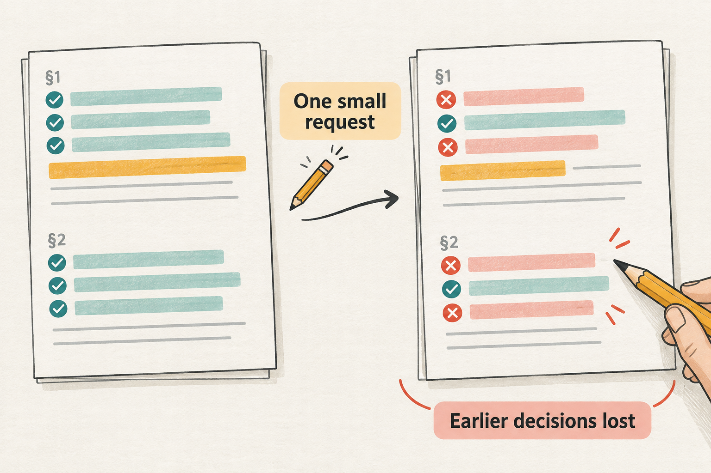](assets/page-writing-illustrations/v1/detailed/01-small-edit.png) | [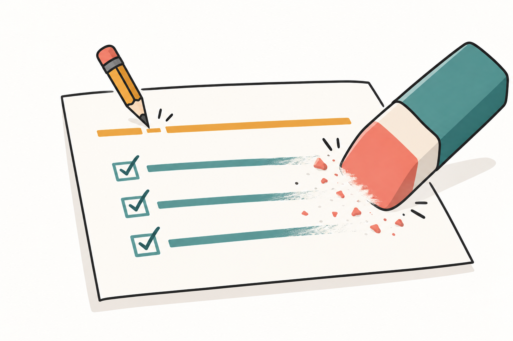](assets/page-writing-illustrations/v1/cartoon/01-small-edit.png) |

## A draft helps me discover what I mean

A candidate draft helps the author discover and refine the intended point.

| Detailed explanation | Cartoon illustration |
| --- | --- |
| [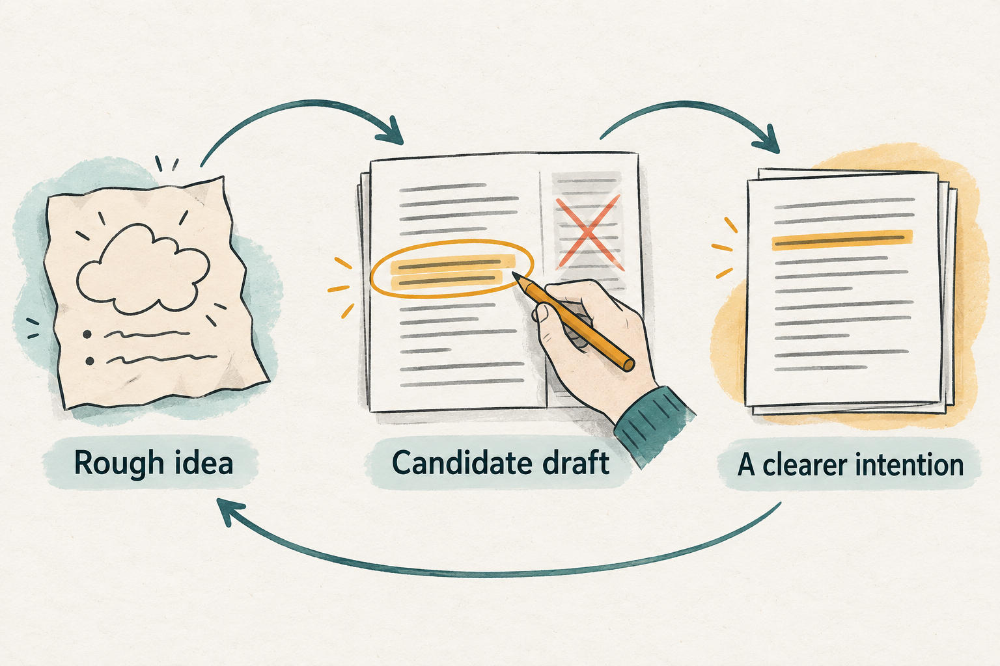](assets/page-writing-illustrations/v1/detailed/02-discover-through-drafting.png) | [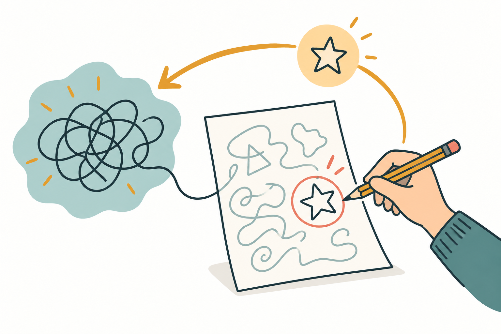](assets/page-writing-illustrations/v1/cartoon/02-discover-through-drafting.png) |

## See the argument before polishing the sentences

See paragraph logic, then compare each planned point with its sentence.

| Detailed explanation | Cartoon illustration |
| --- | --- |
| [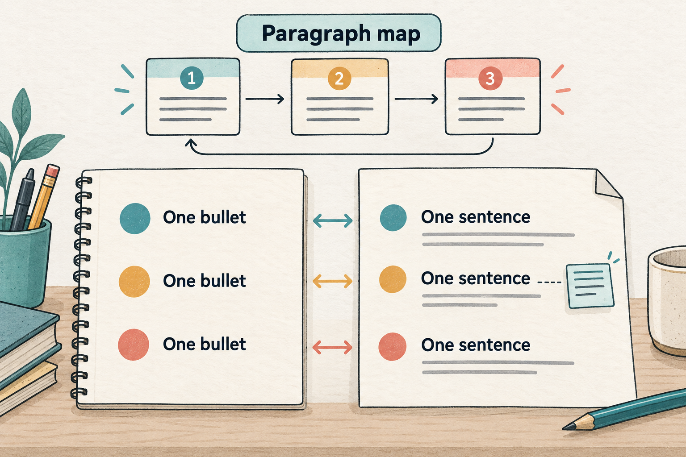](assets/page-writing-illustrations/v1/detailed/03-see-the-argument.png) |  |

## Keep the feedback with the words it refers to

Keep the exact feedback attached to the exact text, alongside the resulting change.

| Detailed explanation | Cartoon illustration |
| --- | --- |
| [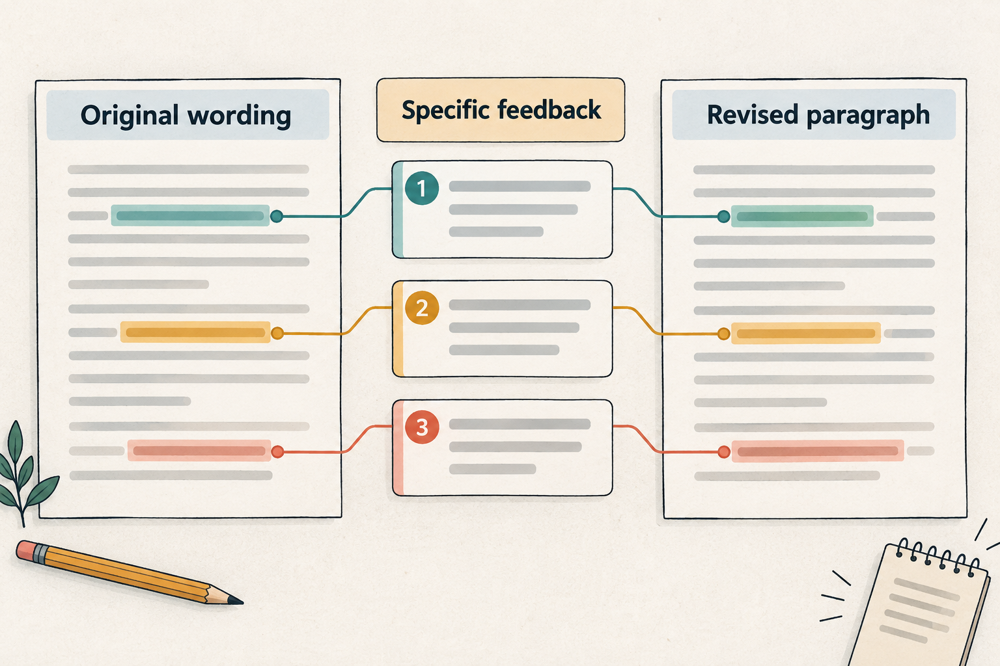](assets/page-writing-illustrations/v1/detailed/04-keep-feedback.png) | [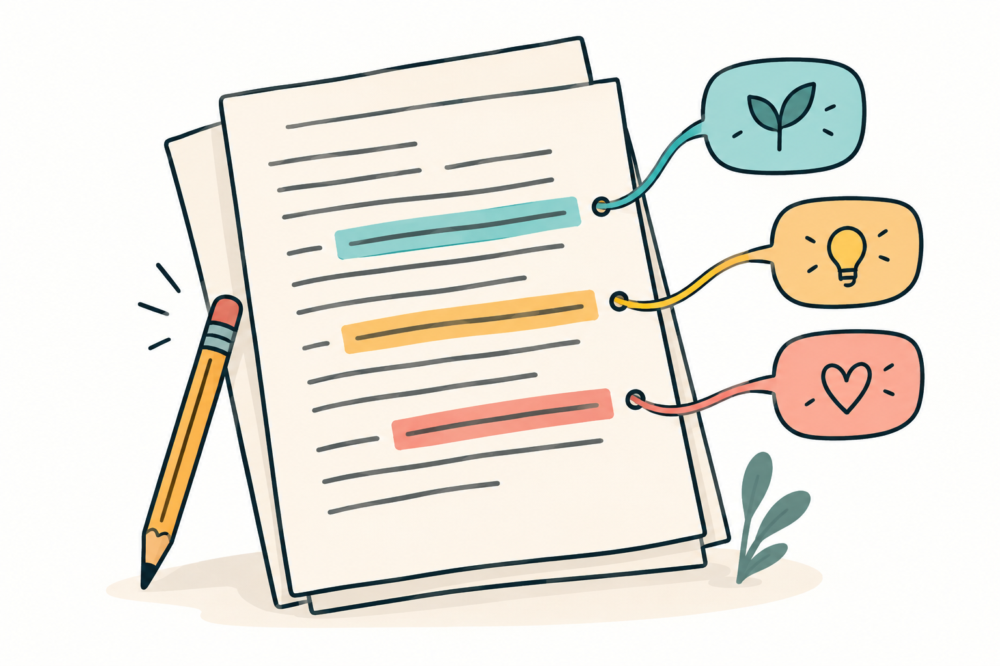](assets/page-writing-illustrations/v1/cartoon/04-keep-feedback.png) |

## A sentence edit should stay a sentence edit

Change the requested span; keep settled surrounding text intact.

| Detailed explanation | Cartoon illustration |
| --- | --- |
| [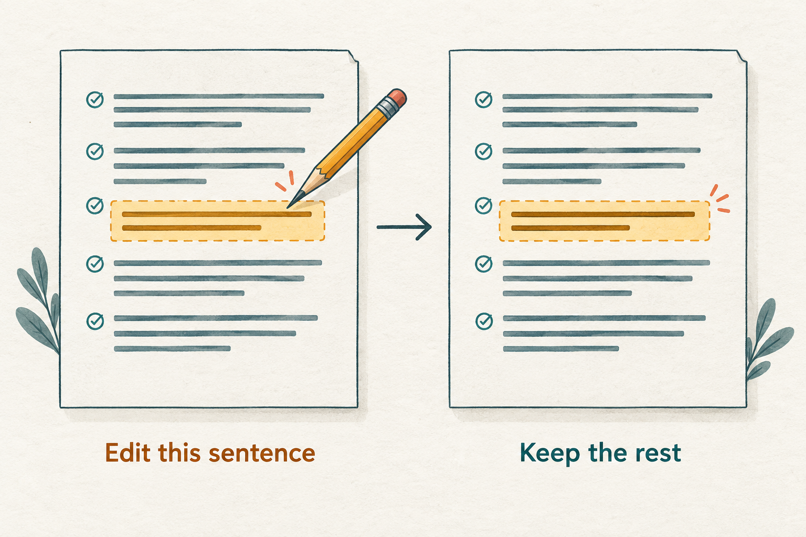](assets/page-writing-illustrations/v1/detailed/05-edit-within-scope.png) | [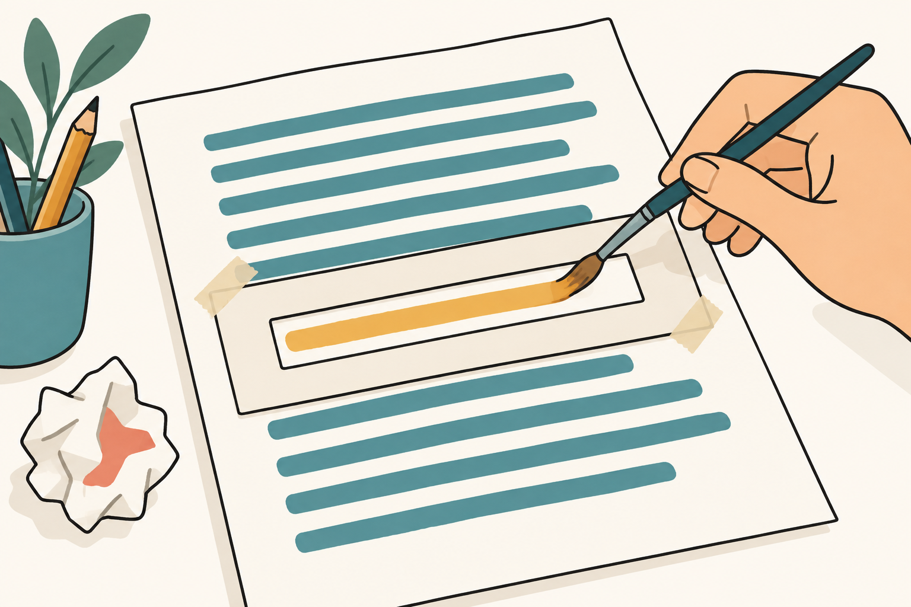](assets/page-writing-illustrations/v1/cartoon/05-edit-within-scope.png) |

## One run, with steps we can return to

A Run contains Steps that preserve the exchange and let us resume.

| Detailed explanation | Cartoon illustration |
| --- | --- |
| [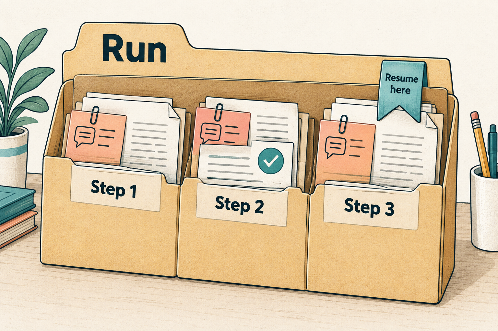](assets/page-writing-illustrations/v1/detailed/06-run-and-steps.png) |  |

## Return the revision while the thought is fresh

Save and return the small revision promptly; longer tasks can proceed separately.

| Detailed explanation | Cartoon illustration |
| --- | --- |
| [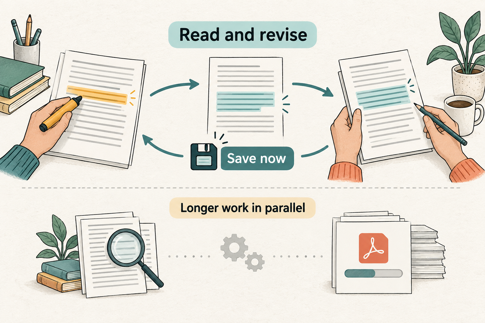](assets/page-writing-illustrations/v1/detailed/07-fast-revisions.png) | [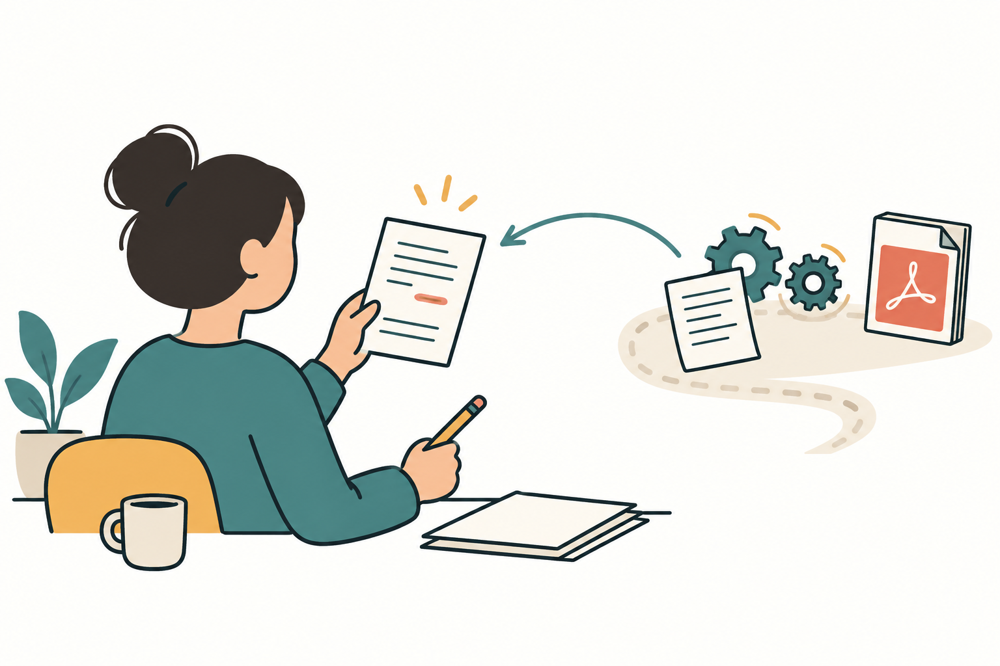](assets/page-writing-illustrations/v1/cartoon/07-fast-revisions.png) |

## Evidence can change what we are able to say

Missing support stays visible; contradictory evidence returns the claim for discussion.

| Detailed explanation | Cartoon illustration |
| --- | --- |
| [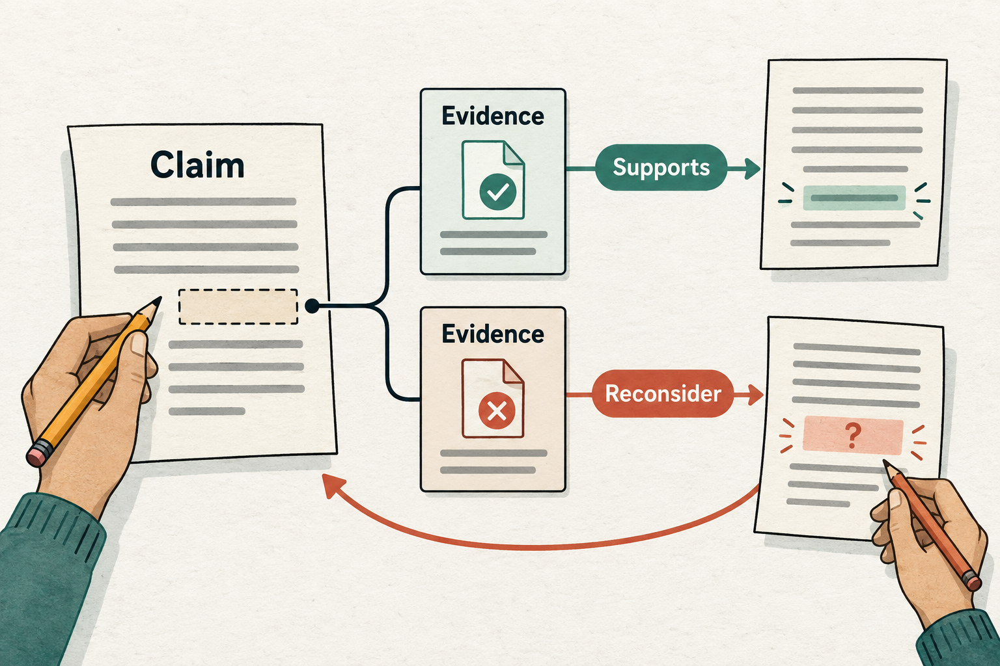](assets/page-writing-illustrations/v1/detailed/08-evidence-and-claims.png) |  |

## Let repeated feedback teach us how to write

Learn preferences from repeated examples while keeping context-specific comments local.

| Detailed explanation | Cartoon illustration |
| --- | --- |
| [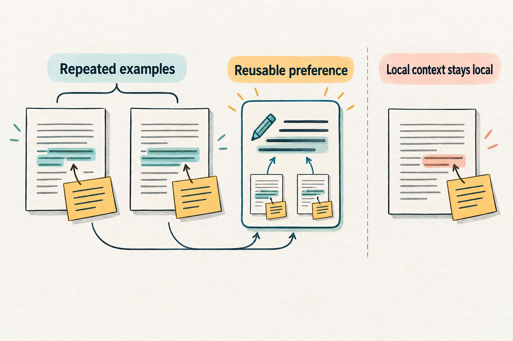](assets/page-writing-illustrations/v1/detailed/09-learn-from-feedback.png) |  |

## Vibe Writing Everywhere

Resume on another device with the paragraph and its decisions intact.

| Detailed explanation | Cartoon illustration |
| --- | --- |
| [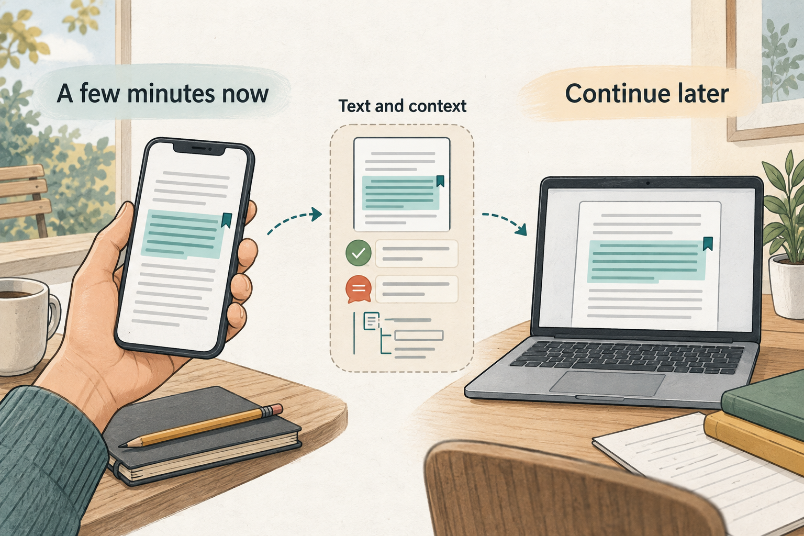](assets/page-writing-illustrations/v1/detailed/10-writing-everywhere.png) |  |

---

These are conceptual illustrations, not screenshots of implemented software or research evidence. Generated with the built-in image generation tool. [Prompts](assets/page-writing-illustrations/v1/prompts.json) · [Original quotations](page-writing-philosophy.md) · [English reading edition](page-writing-philosophy-english.md).
