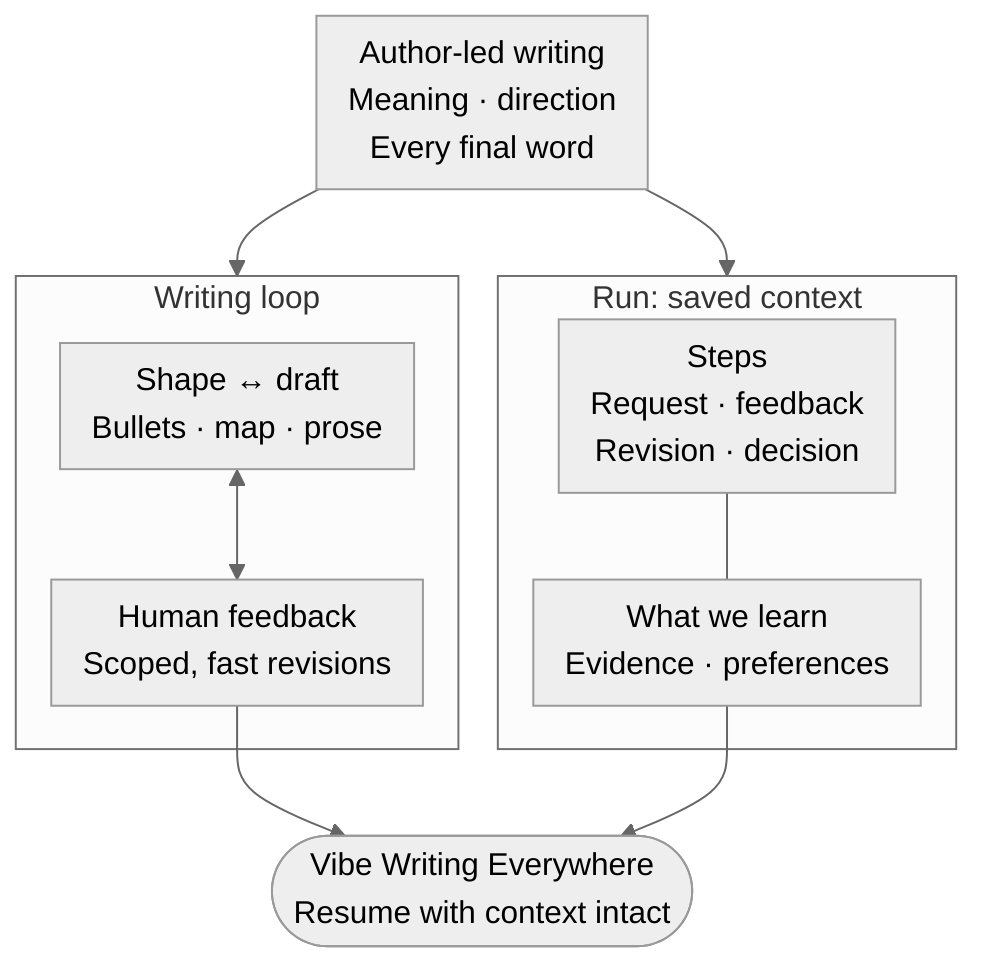

# The Paragraph We Finally Agreed On

## When a small edit undoes earlier decisions

Consider a familiar exchange. We have been working on two paragraphs of a paper's introduction. The opening finally starts with the right subject. A distracting explanation has moved out of the way. The second paragraph now follows naturally from the first. There is one sentence left that feels heavy, so I highlight it and ask the AI to make it easier to read.

The response arrives. The sentence is shorter. But the opening has also changed, the distracting explanation has returned, and a transition we had carefully removed is back in a different form.

Now I have to read both paragraphs again. I have to explain again why the opening mattered. The time I spent making those decisions has become work I must repeat.

This experience is the starting point for how I want to design our Page workflow. I want each round of writing to carry forward what we have already learned about the piece.

## A draft helps me discover what I mean

An AI can give me a draft before I have fully decided what I want to say. That can be useful. Reading an actual paragraph exposes questions that an empty page does not. I may discover that I have introduced a method too early, that two apparently different points are the same point, or that the sentence I thought was essential distracts from the argument.

My initial instruction might be, “Start with variation in physician behavior.” After reading the draft, I become more specific: “Keep the physician as the subject. The measurement method belongs later. I want the reader to understand the behavior before we explain how we observe it.”

The draft has helped me articulate a requirement I could not have stated as clearly at the beginning. The next draft should inherit that requirement.

This is why I distinguish a Task run from a Page run. When I delegate a task, I usually want to specify the work and its checks, then let the agent organize the execution. It might locate a source, run an analysis, or turn an accepted manuscript into a PDF. Those tasks still require judgment and verification. I simply do not need to participate in every intermediate operation.

> Task run：我说我想要什么，之后就丢给它不管了，中间怎么设计、step 1、step 2、step 3 具体怎么走，我们并不 care。

A Page run gives me a different role. I participate in deciding what the work should become. The agent proposes language; I read it and make choices. Those choices change what the agent should do next. A useful writing tool must make room for that exchange throughout the work.

> 写作：没有一个最终结果去直接验证写得好不好，还是需要写的人进去把每个 paragraph 的角角落落都捋直，整个走向也要自己确定

## See the argument before polishing the sentences

I would begin a section with a small map. Each paragraph has a purpose, and the arrows explain why one paragraph follows another. If I cannot explain an arrow, I may not yet understand the transition. Seeing the whole section helps me notice that a result arrives before the reader knows the question, or that three paragraphs are all trying to establish the same motivation.

> 然后在这个 session 的时候呢，我们把这个 mermaid，M-E-R-M-A-D，画出来。然后呢，你再去改整个 paragraph。

Then we put one or two paragraphs in front of us. Sometimes three. Enough to read a connected passage and judge its direction, without having to review the whole paper after every change.

> 就比如说每一次一个 turn，可能是我同时 show 两三个 paragraph。然后呢，我就是说，然后我就可以去选中，然后标注，然后给 feedback。然后你就基于我的 feedback 去改，这样子。

Beside the prose, I want the planned points and the evidence they need. The left side says what a sentence is trying to do. The right side shows the sentence itself. Looking between them, I can ask whether the prose actually says what the plan promised.

> 我觉得在 shape 的时候，其实既要 shape bullet points，其实也要看一看这个 paragraph 这个 content 长什么样子

The outline will change during this process. A bullet may look precise until we try to express it. If it needs two sentences to make two separate points, we should revisit the bullet. If a sentence quietly introduces a new claim, we should decide whether that claim belongs and what would support it. We can start from either column and work toward agreement between them.

> 因为我们想说一句话表达一个点嘛，一句话表达一个点，然后那这样的话就是，那一个点就是一个 bullet points。所以就是我们还是要 map bullet points 和 sentence。

## Keep the feedback with the words it refers to

Much of my feedback will be untidy. I may select a phrase and write, “This makes the method sound like the main contribution.” I may dictate a half-finished thought. I may point to the end of a paragraph and say, “We have already said this. What does the reader learn here?”

I want those words preserved. A later summary such as “improved clarity and flow” loses the useful part: what bothered me, what I wanted instead, and why.

> 不管怎么说，我修改的过程是需要被记录下来的，因为我觉得我的这些 feedback 非常 valuable，必须保留，要不然花时间改了都不知道改到哪里去了，就浪费了。

Each feedback item should remain attached to the text I was looking at. The record should show how the agent interpreted it and what changed. If I gave four comments, I should be able to find all four responses. A comment that could not be applied should still be there, with an explanation.

> 这个 feedback 是 item-based 的，比如选出 3 到 4 块内容，每块分别对应我的 feedback。

The revised passage must then come back as complete paragraphs. A list of changed sentences makes me reconstruct the reading experience in my head. I want to read the actual result, including the sentences that stayed. The version in the response should match the version saved in the workspace, so the sentence I highlight has an unambiguous home.

## A sentence edit should stay a sentence edit

The scope of a revision matters just as much as its quality. If I ask for a shorter sentence, I expect a shorter sentence. If I ask to change the emphasis, the agent should examine what the sentence makes prominent. If I say the paragraph's logic is wrong, then we can reconsider its structure and revise the bullets with it.

> 1. 局部修改：比如改一些词、句子或从句。主谓等写作方式变一变，意思不变，但把强调的主体变一变、逻辑改通顺，比如不要被一个新东西喧宾夺主之类的。
>
> 2. 段落重写：整个 paragraph 都不行、逻辑都乱了，那就可能需要重写。

Once I say a paragraph is right, that decision should survive the next turn. We may need to reopen it later, but we should know that we are doing so and why. Otherwise, every small request becomes an invitation to reconsider everything, and the author must keep guarding sentences that were already settled.

> 比如我们把某一个 paragraph 写完，在 outline 和 draft 阶段把 bullet 确定好之后，对应的 paragraph 就先敲定死不再改了。

## One run, with steps we can return to

The run gives this work a durable identity. It might cover an entire introduction, or only two paragraphs that need attention. A run contains steps. Each step records one meaningful input and the response it produced: the starting brief and first draft, then the comments and revised draft, and eventually the decision to accept the result. A version marks a revision episode in that history. It does not add another execution level between a run and its steps.

> Step is under the run. Do you get it?

A step should be small enough to understand. I should be able to open it and see the old wording, my feedback, the change, and the resulting passage. The current workspace shows what we are writing now. The history lets us recover what we wrote before and the decisions that brought us here.

Waiting for me to read is part of the process. The model does not need to stay running while I am away. When I return, perhaps in a different session, the saved work should tell us which paragraphs are accepted, which comments remain open, and where to continue.

## Return the revision while the thought is fresh

Speed matters here too. If I comment on one sentence, I want the revised passage back while I still remember what I was trying to fix. A full PDF build or a wider evidence search can happen separately when needed. The comment and the new wording still need to be saved promptly. Otherwise, the next interruption could lose the very exchange that would have helped us resume.

> 就是说有些东西可以是 background 去 run，对吧？然后但是我们在调的时候使用的时候就是不要有太高的延迟。

There will still be days when I need an uninterrupted hour to rethink a section. I want the smaller moments to count as well. A five-minute exchange might settle a transition, preserve a new idea, or explain why a sentence feels wrong. When I sit down for longer, those decisions should already be there. I want to resume the thought as readily as I reopen the document.

When I accept a version, we keep it. If I come back a week later with a new idea, we begin another version from that accepted text. I can change my mind without erasing the earlier decision. If an older sentence turns out to be better, we can bring it forward and record the choice.

## Evidence can change what we are able to say

Evidence work fits alongside this exchange. We can agree on a paragraph's organization while a citation or numerical result is still being checked. Any missing support stays explicit in the working materials. An agent can carry out the search or calculation and return the result.

> 比如找 evidence 的部分：去 discovery 找 citation，或者跑 regression、跑 code 这些来补充 evidence，往敲定好的 draft 里面插。

Sometimes the result fits the claim, and we fill the agreed place. Sometimes it contradicts what we had hoped to say. Then we bring that finding back to the affected paragraph. Human agreement about wording cannot make unsupported evidence true, and an evidence worker should not quietly rewrite the argument to conceal a mismatch.

Once the wording and evidence are settled, producing the formal page and its exports should carry that work forward faithfully. A PDF build should not become another unrequested prose revision. I want to recognize the paragraph we agreed on when I open the finished document.

> 我只会 check 这些：
>
> 1. Outline table
> 2. Display 的 PDF 或者是其他 evidence 的 PDF
> 3. 最终page的 PDF

## Let repeated feedback teach us how to write

Over time, these records could also teach us how I prefer to write. Some preferences may recur: concrete subjects, a clear purpose for each sentence, explanations that arrive when the reader needs them. Others belong to a particular passage. “Do not discuss measurement here” may be exactly right for an opening paragraph and exactly wrong for the next section.

> 在很多个 run/round 里面，我们以后可以留下来做总结和思考，把这些总结思考沉淀、提升到我们之后的 writing rules 里面。

Keeping the context makes that distinction possible. A useful writing rule can point back to examples of where it helped. We can examine the original comment and its effect before deciding to apply it more widely.

## Vibe Writing Everywhere

I want to be able to return wherever I happen to be. Writing should not require me to sit down in an office, or find a table at a coffee shop, before I can begin. Sometimes I have ten minutes between meetings. Sometimes I am waiting for an appointment and suddenly understand what the second paragraph should say. I want to open that paragraph and work on it while the thought is still clear.

> 所以不能说我们正襟危坐，在 office，在星巴克里面摆好桌子，点杯咖啡才开始写，而是说，我随时随地说，啊，我要写这个 paragraph，我要写这个 section，我就能续上，你知道吗？我就能续上。

Those ten minutes can disappear before I write a word. I open a Word document and find the text we saved. But if we saved only the manuscript, I must remember the discussion around it. Why did we remove that example? Was this sentence agreed, or was it still a suggestion? What was bothering me about the transition? The words are there. Recovering the reasons can take the whole break.

> 你要是我直接打开一个 Word，对吧？只有文本，但我们之前那个 context 就丢了。所以现在我们这样做呢，是把 context 也存起来，这样的话就可以非常丝滑地进行下一步。

This is what I mean by vibe writing, alongside vibe coding. I want to describe what I have in mind, read what the AI proposes, and shape the paragraph or section through our exchange. I should be able to select a sentence on my phone, dictate a rough objection, read a revision, and leave. Later, on another device or in another conversation, we should continue from that exchange. I should not have to explain the section again.

> Vibe writing and vibe coding. That is what I said

The context we save must help with that return. Beside the current passage, I want a short account of where we stopped: the opening is agreed; the next paragraph still introduces measurement too early; one citation is being checked. My original comment should remain available if the summary leaves something out. The paragraph map can remind me where this passage leads. I can then spend the few minutes I have making the next decision.

Saving every message is useful, but making me reread the entire conversation would defeat the purpose. The tool should recover the relevant working state before it proposes another change. It needs to distinguish a settled choice from an open question, and an abandoned suggestion from the current plan. That knowledge should live with the work, so continuing does not depend on keeping one particular chat alive.

I do not want maintaining this history to become another job for the author. My part should remain familiar: read, select, comment, discuss, accept, continue. The system should preserve the exchange as it happens. The reading surface can stay quiet, with the paragraphs in front of me and direct links to their bullets and evidence.

That is the experience I want to return to the next morning. I open the work, find the paragraph we finally agreed on, and see the reason we chose its opening. The second paragraph still has one unresolved comment. I select the sentence, explain what I mean, and we continue from there.

---

Edition note: Blockquotes preserve JL's exact words in their original language. The example exchanges are illustrative.

Design note: This essay describes the intended Page writing experience discussed on September 11, 2026, not a claim that every capability is implemented.
