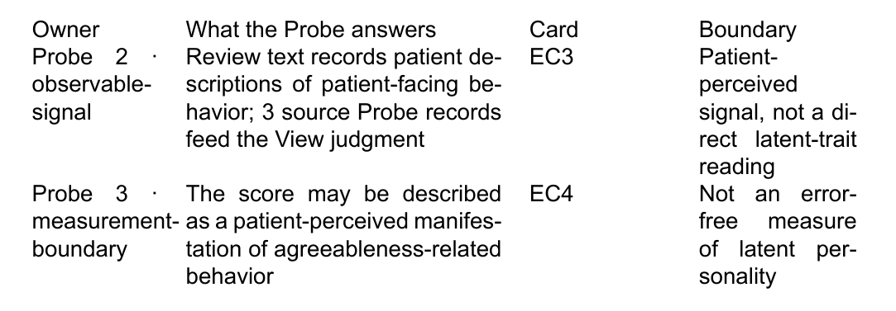

# Agreeableness evidence view: bound sources, observable signal, and measurement boundary
state: 🟡 PARTIAL · unified structure built and validated; human acceptance still open
owner: CC
method: organize two answered QA Probes into one readable and validated View
page-type: view
view-unit: views/QY1-for-view

## Opening
What can a reader safely conclude about agreeableness evidence from the two Probes this View binds, and who may reuse that reading downstream?
This View organizes the observable-signal Probe and the measurement-boundary Probe from `tasks/QV1-agreeableness/` into one readable body, one owner-indexed evidence table, and one downstream consumer relation.
It is a forward validation specimen for `haipipe-view` and `haipipe-page-for-view`, built fresh from the skill docs rather than copied from QBt1.

**Application identity**: `QY1-for-view.md` is the only authored semantic source. The same-named resource folder holds inputs, the Display, and generated review formats; there is no duplicate `view.md`.

**Where this page sits**: it binds Probe 2 (observable project signal, which also resolves the bound source-Probe count through the task QA-bank) and Probe 3 (measurement boundary), both drawn from QBt1's own bound-Probe set, since the QV1-agreeableness task folder carries only one dedicated QA file. See Log for this inference.

## Diagram

**View relation**: answered QA inputs become readable content, one Display, and one consumer binding.

```text
QA-bank → Probe 2 (observable signal) ─┐
QA-bank → Probe 3 (measurement bound) ─┴─▶ QY1 View body + Cards ─▶ QY1-Display1 ─▶ S-Main-4 (planned)
```

## Content

### 1 · QA inputs
**Input bindings**: the answered Probes and QA-banks used by this View.

```text
input/QA-probes/2-observable-signal.md   → observable signal + bound source-Probe count
input/QA-probes/3-measurement-boundary.md → the strongest measurement claim this View may make
```

This View binds two answered Probes carried over from QBt1's own Probe set.
> Card two answered QA Probes: QI1 · QA input · Bindings: `views/QY1-for-view/input/QA-probes/2-observable-signal.md`, `views/QY1-for-view/input/QA-probes/3-measurement-boundary.md`. Status: answered. Role: supply the material organized by this View.

Probe 2 resolves the bound source-Probe count through its own task QA-bank answer.
> Card task QA-bank answer: QI2 · QA bank · Binding: `../../tasks/QV1-agreeableness/QA/1-bound-source-count.md`. Consumer question: Q-View-1. Status: answered.

The current View binds 3 source Probe records into its underlying judgment [Q-View-1], even though only two of those Probe files are copied directly into this View's own `input/QA-probes/`.

### 2 · View body
**Readable body**: the topic-specific material a person should understand.

```text
observable signal + measurement boundary → one bounded reading of agreeableness evidence
```

#### 2.1 · Observable project signal

Review text directly records patient descriptions and evaluations of patient-facing behavior, so the review-derived score is a patient-perceived signal rather than a direct instrument reading.
> Card patient-perceived signal: EC3 · Value · Finding: the project observes descriptions and evaluations of behavior, not the trait itself. Bearing: qualifies. Boundary: observed signal, not direct latent trait. Binding: `views/QY1-for-view/input/QA-probes/2-observable-signal.md`. Freshness: current. Used by: QY1-Display1.

The literature-side construct frame for agreeableness rests on the standard trait taxonomy \citep{john1999bigfive}.

#### 2.2 · Measurement boundary

The strongest claim this View may support is that the score is a patient-perceived manifestation of agreeableness-related behavior.
> Card patient-perceived manifestation: EC4 · Construct · Finding: the two bound Probes do not justify a claim of error-free latent-personality measurement. Bearing: bounds this View. Boundary: manifestation only, not a validated latent-trait instrument. Binding: `views/QY1-for-view/input/QA-probes/3-measurement-boundary.md`. Freshness: current. Used by: QY1-Display1.

Any stronger claim would require direct construct-validation evidence that these two Probes do not contain.
The body is not a hidden evidence ledger; EC3 and EC4 let a reader inspect why each exact phrase is present.

### 3 · Displays
**Display outputs**: each output selects View-body content and keeps an independent acceptance state.

```text
EC3, EC4 → QY1-Display1 → owner-indexed evidence table
```

QY1-Display1 is the owner-indexed evidence table: one row per bound Probe, showing what it answers, its Card, and its boundary. Its current raster is embedded below; click QY1-Display1 and the same preview appears first, before its View-body bindings, files, and independent acceptance state.



> Card QY1-Display1: Display · Kind: table · Bindings: EC3, EC4 · Files: `views/QY1-for-view/output/QY1-Display1-agreeableness-evidence-table/output.md`, `views/QY1-for-view/output/QY1-Display1-agreeableness-evidence-table/preview.png`, `views/QY1-for-view/output/QY1-Display1-agreeableness-evidence-table/preview.pdf` · State: rendered, acceptance waiting.

`preview.pdf` carries the same table as the printable full-fidelity inspection surface: `views/QY1-for-view/output/QY1-Display1-agreeableness-evidence-table/preview.pdf`.

QY1-Display1 is the only Display in this specimen; no prose pack or evidence ledger is added as a separate optional output.

### 4 · Consumers
**Consumer bindings**: downstream Pages or applications and what they use.

```text
QY1-Display1 → Main Results section (S-Main-4) → Results / construct interpretation, planned
```

The Main Results section is the planned downstream reader for QY1-Display1's construct-interpretation row.
> Card Main Results section: C1 · Consumer · Target Page: S-Main-4 · Binding: `../../QS-consumers/S-Main-4-results.md` · Uses: QY1-Display1 · Placement: Results / construct interpretation · Status: planned, blocked on View and Display acceptance.

`S-Main-4-results.md` is the live Board Page this Card points to; it is read here for reference only and is not modified by this View.
A consumer may still reach a Probe directly when its own contract permits it; the View route remains the normal human-readable handoff.

## Aims

### A1 · QA inputs
- A1.1 · Bind two answered Probes without copying the task QA-bank answer they both resolve through.
  **Done when:** The Page names both Probe files and the rich Q reference reaches the task QA-bank answer.
- A1.2 · Keep the input structure legal for one or several QA-bank groups.
  **Done when:** `inputs.qa_probes` stays a plural array under `input/QA-probes/`.

### A2 · View body
- A2.1 · Make the View body substantive rather than a manifest or evidence ledger.
  **Done when:** A reader can understand the observable signal and the measurement boundary without opening a Card.
- A2.2 · Cite the Big Five taxonomy through the human-editable bibliography.
  **Done when:** `\citep{john1999bigfive}` resolves against `input/sources/references.bib`.

### A3 · Displays
- A3.1 · Produce one independently inspectable owner-indexed Display from selected View-body content.
  **Done when:** QY1-Display1 shows a PNG in the Page, opens the same preview first in its rich Display Card, links the printable PDF, and names its View-body bindings.
- A3.2 · Keep the output contract minimal.
  **Done when:** Only QY1-Display1 is mandatory in this specimen.

### A4 · Consumers
- A4.1 · Make the downstream use relationship a clickable Consumer Card.
  **Done when:** The exact words "Main Results section" open C1 with a real `S-Main-4-results.md` target, uses, placement, and gate state.
- A4.2 · Keep consumer handoff gated independently from evidence validity and Display rendering.
  **Done when:** The review projection can be built and checked while C1 remains blocked on human acceptance.

## States

### A1 · QA inputs
- ✅ A1.1 · `check` reports 2 QA probes bound; QI2's Q reference resolves to `tasks/QV1-agreeableness/QA/1-bound-source-count.md`.
- ✅ A1.2 · `inputs.qa_probes` is a two-element array under `input/QA-probes/`.

### A2 · View body
- ✅ A2.1 · Content 2 presents two readable topic-specific subsections before any Card is opened.
- ✅ A2.2 · `\citep{john1999bigfive}` is present in the body and the key exists in `references.bib`.

### A3 · Displays
- ✅ A3.1 · QY1-Display1 embeds `preview.png`, links `preview.pdf`, and names EC3/EC4 as its View-body bindings.
- ✅ A3.2 · Only QY1-Display1 exists in `manifest.json.displays`.

### A4 · Consumers
- ✅ A4.1 · C1 points to `../../QS-consumers/S-Main-4-results.md`, uses QY1-Display1, and states placement Results / construct interpretation.
- 🧠 A4.2 · Waits on a person to accept the View and QY1-Display1; `S-Main-4-results.md` itself independently states the same blocked gate and is not modified by this run.

## Files

- `QY1-for-view.md`
  The canonical View Page and only semantic source.
- `views/QY1-for-view/manifest.json`
  Input, Display, consumer, and review-build bindings.
- `views/QY1-for-view/input/QA-probes/`
  The two answered Probe records this View organizes.
- `views/QY1-for-view/input/sources/references.bib`
  Human-editable canonical BibTeX, including `john1999bigfive`.
- `views/QY1-for-view/output/QY1-Display1-agreeableness-evidence-table/`
  The one Display output, including `preview.png` and `preview.pdf`.
- `../../tasks/QV1-agreeableness/QA/1-bound-source-count.md`
  The task QA-bank answer QI2 points to.
- `../../QS-consumers/S-Main-4-results.md`
  The downstream Consumer Page reached directly from C1; read-only reference, not modified by this run.
- `views/QY1-for-view/build/review/`
  Generated `.tex`, `.pdf`, `.docx`, copied bibliography, and freshness receipt.

## Log

- 260810 · [CREATE-CC] Scaffolded `QY1-for-view.md` and `views/QY1-for-view/` fresh with `scripts/view.py create`, as a skill-forward validation run of `haipipe-view` and `haipipe-page-for-view`.
- 260810 · [INFERENCE-CC] `tasks/QV1-agreeableness/QA/` holds only one dedicated QA file (`1-bound-source-count.md`); no sibling task folder under this board carries a second agreeableness-evidence Probe. Reused QBt1's own bound Probes 2 and 3 (`2-observable-signal.md`, `3-measurement-boundary.md`) as the two answered QA Probe records, since they are genuine answered records suitable for an agreeableness evidence View and Probe 2 itself resolves through the one dedicated task QA-bank file.
- 260810 · [INFERENCE-CC] Bound the Consumer Card to the real `QS-consumers/S-Main-4-results.md` Board Page by relative path (`../../QS-consumers/S-Main-4-results.md`) rather than a review-only cross-reference, since `view.py`'s `resolve_from` walks parent directories and resolves this path without copying or editing the target file.
