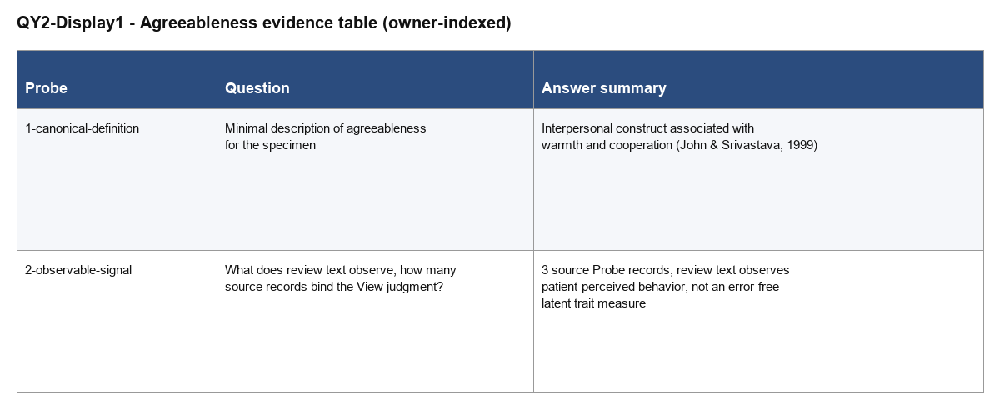

# Agreeableness evidence specimen (QY2 skill-forward validation)
state: 🟡 PARTIAL · unified structure built; human acceptance remains open
owner: JL (fresh-context skill-forward run, second independent pass)
method: organize two answered QA Probes into one readable and validated View
page-type: view
view-unit: views/QY2-for-view

## Opening

QY2 is a small, sandboxed second run of the same View Page contract exercised by
QBt1-for-view, built end-to-end inside `_runs/skill-forward/QY2/` to validate the
`haipipe-page-for-view` / `haipipe-view` skill pair from a fresh context. It lets
a person understand what a minimal agreeableness-evidence View looks like: a
canonical trait definition, an observable project signal, one rendered evidence
table, and one downstream Results-section consumer. Consumers of this Page are
skill reviewers checking that `create`, `check`, `status`, and `build` behave as
documented, and — downstream — the local `S-Results` consumer stand-in.

## Diagram

**View relation**: two answered QA inputs become readable content, one Display,
and one consumer binding.

```text
QA-bank → Probe 1 (canonical definition) ─┐
QA-bank → Probe 2 (observable signal)    ─┼──▶ QY2 View body + Cards ──▶ QY2-Display1 ──▶ S-Results (consumer)
```

## Content

### 1 · QA inputs
**Input bindings**: two answered Probes copied locally into this View's own
`input/QA-probes/` folder.

```text
input/QA-probes/1-canonical-definition.md → canonical trait meaning
input/QA-probes/2-observable-signal.md    → observable signal + bound source count
```

This View imports two answered QA Probes, both copied (not moved, not edited)
from the QBt1 specimen's own input folder for this skill-validation exercise.
> Card two answered QA Probes: QI1 · QA input · Bindings: `views/QY2-for-view/input/QA-probes/1-canonical-definition.md`, `views/QY2-for-view/input/QA-probes/2-observable-signal.md`. Status: answered. Role: supply the material organized by this View.

### 2 · View body
**Readable body**: the topic-specific material a person should understand before
opening any Card.

#### 2.1 · Trait meaning

Agreeableness is an interpersonal trait expressed through warmth and cooperation.
> Card interpersonal trait: EC1 · Literature · Finding: agreeableness is treated as an interpersonal construct. Bearing: supports. Boundary: trait description only. Binding: `views/QY2-for-view/input/QA-probes/1-canonical-definition.md`. Freshness: current. Used by: QY2-Display1.

The literature-side construct frame resolves through the real bibliography \citep{john1999bigfive}.

#### 2.2 · Observable project signal

Review text records patient descriptions of patient-facing behavior, and the
current View binds 3 source Probe records into one evidence judgment, so this
View treats review-derived scores as patient-perceived signals rather than an
error-free latent trait measure.
> Card 3 source Probe records: EC2 · Value · Finding: the project observes descriptions and evaluations of behavior across 3 bound source records. Bearing: qualifies. Boundary: observed signal, not direct latent trait. Binding: `views/QY2-for-view/input/QA-probes/2-observable-signal.md`. Freshness: current. Used by: QY2-Display1.

The body is not a hidden evidence ledger. It is the human-readable synthesis
produced from the two inputs above; the Citation and Value Cards let a reader
inspect why each exact phrase is present.

### 3 · Displays
**Display outputs**: one rendered table selects and compares both View-body
findings.

QY2-Display1 is the agreeableness evidence table. Its current raster is embedded
below; opening QY2-Display1 shows the same preview first, before its View-body
bindings, files, and independent acceptance state.



> Card QY2-Display1: D1 · Display · kind: table · reader job: compare the canonical trait definition and the observable project signal. Bindings: EC1, EC2. Binding: `views/QY2-for-view/output/QY2-Display1-agreeableness-evidence-table/output.md`. Status: rendered. Acceptance: waiting.

`preview.pdf` is the printable inspection surface for the same table; it sits
alongside `preview.png` in the same Display folder.

### 4 · Consumers
**Consumer bindings**: one local Results-section stand-in inside the QY2 sandbox
plans to use QY2-Display1.

The Results section plans to consume QY2-Display1 for its construct-interpretation passage.
> Card Results section: C1 · Consumer · Target Page: S-Results · Binding: `consumers/S-Results.md`. Uses: QY2-Display1. Placement: Results / construct interpretation. Status: planned, blocked on View and Display acceptance.

## Aims

### A1 · QA inputs
- A1.1 · Bind two answered Probes locally without editing their source content.
  **Done when:** Both Probe files are present unmodified under `input/QA-probes/` and named in this Page.

### A2 · View body
- A2.1 · Make the View body substantive rather than a manifest or evidence ledger.
  **Done when:** A reader can understand trait meaning and observable signal without opening a Card.

### A3 · Displays
- A3.1 · Produce one independently inspectable Display from selected View-body content.
  **Done when:** QY2-Display1 shows a real PNG in the Page, links a real PDF, and names its View-body bindings.

### A4 · Consumers
- A4.1 · Make the downstream use relationship a clickable Consumer Card pointing at a real local Page.
  **Done when:** The exact words "Results section" open C1 with a real target file inside the QY2 tree, selected output, placement, and gate state.

## States

### A1 · QA inputs
- ✅ A1.1 · Both Probe files were copied unmodified from QBt1's own `input/QA-probes/` and are named in Content 1.

### A2 · View body
- ✅ A2.1 · Content 2 presents two readable topic-specific subsections before any Card is opened.

### A3 · Displays
- 🟡 A3.1 · QY2-Display1 is rendered with real PNG/PDF previews; human acceptance is still waiting.

### A4 · Consumers
- 🟡 A4.1 · C1 points at the real local `consumers/S-Results.md` Page; placement is planned and blocked on View/Display acceptance.

## Files

- `QY2-for-view.md`
  The canonical View Page and only semantic source.
- `views/QY2-for-view/manifest.json`
  Input, Display, consumer, and review-build bindings.
- `views/QY2-for-view/input/QA-probes/`
  Two answered Probe records copied from QBt1's own input folder.
- `views/QY2-for-view/input/sources/references.bib`
  Bibliography copied from QBt1's own `input/sources/references.bib` (includes `john1999bigfive`).
- `views/QY2-for-view/output/QY2-Display1-agreeableness-evidence-table/`
  The one Display, including real `preview.png` and `preview.pdf`.
- `views/QY2-for-view/build/review/`
  Generated `.tex`, `.pdf`, `.docx`, and freshness receipt.
- `consumers/S-Results.md`
  The local downstream Consumer Page reached directly from C1.

## Log

- 260810 · [BUILD-Sonnet] Fresh skill-forward validation run QY2: created the canonical Page/resource pair with `view.py create`, bound two Probes and one bibliography copied from QBt1's own input folder, rendered QY2-Display1 with real PNG/PDF previews, added a real local Results consumer Page, and stopped before human acceptance.
