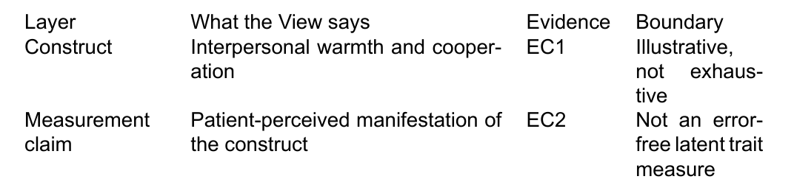

# The second unified View regression: two probes, one table, one local consumer
state: 🟡 PARTIAL · unified structure re-instantiated with a narrower probe set; human acceptance remains open
owner: JL
method: build a fresh regression specimen from two reused QBt1 Probes and a local consumer
page-type: view
view-unit: views/QY3-for-view

## Opening
Does the unified View structure still hold when a View binds only two of QBt1's answered Probes instead of three, and hands off to a consumer that lives inside the run itself rather than the shared QS group?
QY3 reuses QBt1's canonical-definition and measurement-boundary Probes and its real bibliography, renders one table Display, and points at one local consumer Page.
This is a fresh-context regression: it must reach the same mechanical shape as QBt1 without touching QBt1, QY1, or QY2.

## Diagram

**The relation model**: two reused QA Probes enter one readable View, which produces one table Display and serves one local consumer.

```text
LEFT · QA INPUTS                    MIDDLE · VIEW                       RIGHT · CONSUMER

QBt1 Probe 1 (definition)  ─┐        QY3-for-view.md                    ┌─▶ QY3-Consumer-boundary-note
QBt1 Probe 3 (boundary)    ─┼──────▶ ├─ View body                      ─┘   (local, inside _runs/QY3)
                                     ├─ Citation · Value Cards
                                     ├─ QY3-Display1 (table)
                                     └─ validation
```

## Content

### 1 · QA inputs
**The incoming side**: this View binds two of QBt1's three answered Probes, reused by path into its own `input/QA-probes/` copy.

```text
QA-bank ─▶ answered Probe (definition) ─┐
QA-bank ─▶ answered Probe (boundary)   ─┴─▶ QY3 input collection
```

This View imports two answered QA Probes: the canonical trait definition and the measurement boundary.
> Card two answered QA Probes: QI1 · QA input · Bindings: `views/QY3-for-view/input/QA-probes/1-canonical-definition.md`, `views/QY3-for-view/input/QA-probes/3-measurement-boundary.md`. Status: answered. Role: supply the material organized by this View.

The observable-signal Probe is deliberately excluded from this regression; only construct meaning and measurement boundary carry through to the Display.

### 2 · View body
**The readable middle**: two short subsections hold the actual substance, while Cards attach provenance to exact words.

```text
readable sentence + exact-span Card ─▶ inspect evidence without leaving the body
```

#### 2.1 · Trait meaning

Agreeableness is an interpersonal trait expressed through warmth and cooperation.
> Card interpersonal trait: EC1 · Literature · Finding: agreeableness is treated as an interpersonal construct. Bearing: supports. Boundary: trait description only. Binding: `views/QY3-for-view/input/QA-probes/1-canonical-definition.md`. Freshness: current. Used by: QY3-Display1.

The literature-side construct frame resolves through the real bibliography \citep{john1999bigfive}.

#### 2.2 · Measurement boundary

The score is not treated as an error-free measure of latent personality.
> Card not treated as an error-free measure of latent personality: EC2 · Construct · Finding: the current evidence does not justify direct latent-personality measurement. Bearing: bounds this specimen. Boundary: patient-perceived manifestation only. Binding: `views/QY3-for-view/input/QA-probes/3-measurement-boundary.md`. Freshness: current. Used by: QY3-Display1.

The body stays a human-readable synthesis; the two Evidence Cards let a reader inspect why each exact phrase is present.

### 3 · Displays
**The visible output**: QY3-Display1 is the trait-boundary table. Its current raster is embedded below; the same preview appears first in its Display Card, before its bindings, files, and acceptance state.



> Card QY3-Display1: QY3-Display1 · Display · Binding: `views/QY3-for-view/output/QY3-Display1-trait-boundary-table/output.md`. Kind: table. Reader job: separate construct meaning from the measurement boundary the two bound Probes support. View-body bindings: EC1, EC2. Status: rendered. Acceptance: waiting. Files: `views/QY3-for-view/output/QY3-Display1-trait-boundary-table/preview.png`, `views/QY3-for-view/output/QY3-Display1-trait-boundary-table/preview.pdf`, `views/QY3-for-view/output/QY3-Display1-trait-boundary-table/float.tex`.

`preview.pdf` is the printable inspection surface for the same table; `float.tex` is the printable wrapper the review build embeds.

### 4 · Consumers
**The outgoing side**: this regression hands off to one local consumer Page instead of a shared QS-consumers Page, so the run stays self-contained.

```text
View ─▶ QY3-Display1 consumer + placement + gate state
```

The local boundary note plans to consume QY3-Display1 for its construct-boundary passage.
> Card local boundary note: C1 · Consumer · Target Page: QY3-Consumer-boundary-note · Binding: `consumers/QY3-Consumer-boundary-note.md`. Uses: QY3-Display1. Placement: Local regression consumer / construct-boundary passage. Status: planned, blocked on View and Display acceptance.

## Aims

### A1 · QA inputs
- A1.1 · Bind exactly two of QBt1's three answered Probes without copying the third.
  **Done when:** The Page names both reused Probe files and excludes the observable-signal Probe.

### A2 · View body
- A2.1 · Make the View body substantive with two topic-specific subsections.
  **Done when:** A reader can understand trait meaning and measurement boundary without opening a Card.

### A3 · Displays
- A3.1 · Produce one rendered, inspectable table Display from the two bound Cards.
  **Done when:** QY3-Display1 shows a PNG in the Page, opens the same preview first in its Display Card, links the printable PDF, and names a real Binding plus a Files field with backtick-quoted `preview.png`, `preview.pdf`, and `float.tex` paths, all real.

### A4 · Consumers
- A4.1 · Make the downstream use relationship a clickable Consumer Card pointing at a Page local to this run.
  **Done when:** The exact words "local boundary note" open C1 with a real local target file, selected output, placement, and gate state.

## States

### A1 · QA inputs
- ✅ A1.1 · `check` confirms both reused Probe files resolve inside `views/QY3-for-view/input/QA-probes/` and the manifest lists exactly two `qa_probes` entries.

### A2 · View body
- ✅ A2.1 · Content 2 presents two readable topic-specific subsections before either Card is opened.

### A3 · Displays
- ✅ A3.1 · QY3-Display1 embeds `preview.png`, its Card carries a real Binding and a Files field naming `preview.png`, `preview.pdf`, and `float.tex`, all present on disk, and acceptance stays `waiting`.

### A4 · Consumers
- 🧠 A4.1 · C1 targets the local `consumers/QY3-Consumer-boundary-note.md` Page and stays `planned`, blocked on View and Display acceptance.

### P · Regression validation
- 🧠 P1 · `check`, `status`, `build`, and `build --check` all ran clean for this specimen; human acceptance still waits on JL.

## Files

- `QY3-for-view.md`
  The only authored semantic source for this regression View.
- `views/QY3-for-view/input/QA-probes/`
  The two reused Probe answers, copied from QBt1's own Probe files.
- `views/QY3-for-view/input/sources/references.bib`
  The reused canonical bibliography, copied from QBt1's own source file.
- `views/QY3-for-view/output/QY3-Display1-trait-boundary-table/`
  The one Display output, including `preview.png`, `preview.pdf`, and `float.tex`.
- `views/QY3-for-view/build/review/`
  Generated `.tex`, `.pdf`, `.docx`, copied bibliography, and freshness receipt.
- `consumers/QY3-Consumer-boundary-note.md`
  The local, run-scoped Consumer Page reached directly from C1.

## Log

- 260810 · [CHECK-SONNET] Fresh regression built QY3-for-view from two of QBt1's answered Probes and its references.bib, rendered QY3-Display1 as a table, pointed C1 at a local consumer Page, and ran check/status/build/build --check without editing anything outside `_runs/skill-forward/QY3/`.
