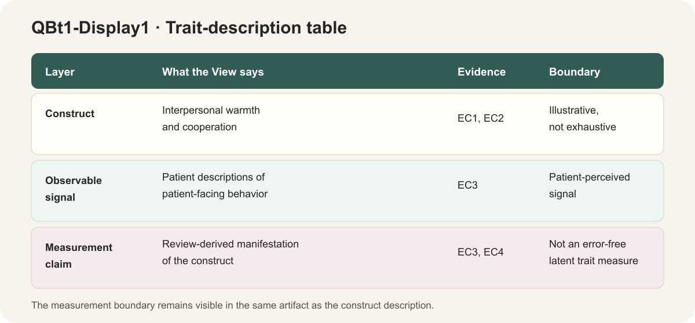

# Measurement-boundary regression View
state: 🟡 PARTIAL · mechanically current; human acceptance waiting
owner: CC
method: organize two answered QA Probes into one inspectable View
page-type: view
view-unit: views/QY4-for-view

## Opening
This isolated regression tests whether one canonical View can keep authored resources separate from a generated distribution.

## Diagram

```text
QA Probes → QY4-for-view.md → QY4-Display1 → local Results consumer
                         └──▶ _fixture review + Paper-ready float
```

## Content

### 1 · QA inputs
Two answered Probe records define the observable signal and its measurement boundary.
> Card two answered Probe records: QI1 · QA input · Bindings: `input/QA-probes/Q1-observable-signal.md`, `input/QA-probes/Q2-measurement-boundary.md`. Status: answered.

### 2 · View body

#### 2.1 · Observable signal
The source describes patient-perceived behavior rather than direct access to a latent trait \citep{john1999bigfive}.
> Card patient-perceived behavior: EC1 · Value · Finding: observed descriptions are the signal. Binding: `input/QA-probes/Q1-observable-signal.md`. Freshness: current.

#### 2.2 · Measurement boundary
The interpretation must preserve the distinction between an observed description and an error-free latent measure.
> Card distinction: EC2 · Construct · Finding: direct latent measurement is not established. Binding: `input/QA-probes/Q2-measurement-boundary.md`. Freshness: current.

### 3 · Displays
QY4-Display1 turns EC1 and EC2 into one inspection table while retaining independent acceptance.



### 4 · Consumers
The local Results consumer plans to use QY4-Display1 after human acceptance.
> Card local Results consumer: C1 · Consumer · Target: `consumers/S-Results.md`. Uses: QY4-Display1. Placement: Results / construct boundary. Status: planned.

## Aims

### A1 · QA inputs
- A1.1 · Bind two answered Probes.
  **Done when:** both source files resolve.

### A2 · View body
- A2.1 · Keep readable interpretation and exact evidence Cards together.
  **Done when:** citation and bindings validate.

### A3 · Displays
- A3.1 · Produce one inspectable table.
  **Done when:** PNG/PDF, float, and assets are current.

### A4 · Consumers
- A4.1 · Name one real local consumer.
  **Done when:** its target resolves and remains planned.

## States

### A1 · QA inputs
- ✅ A1.1 · Both answered Probe files are present.

### A2 · View body
- ✅ A2.1 · The body carries EC1, EC2, and a valid citation.

### A3 · Displays
- 🧠 A3.1 · Artifact rendered; human acceptance waiting.

### A4 · Consumers
- 🧠 A4.1 · Consumer placement planned; handoff waiting.

## Files

- `QY4-for-view.md` — canonical semantic source.
- `views/QY4-for-view/` — authored resources only.
- `_fixture/` — generated distribution only.

## Log

- 260810 · [REGRESSION-CC] Created as an isolated functional test of the source/fixture boundary.
