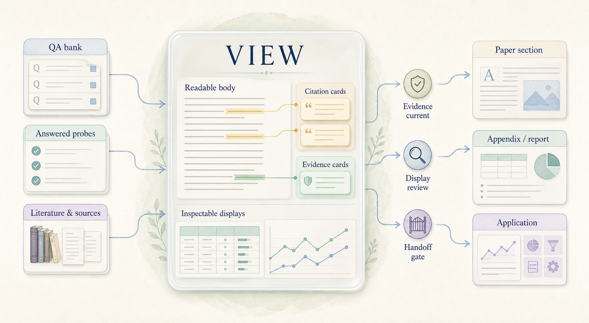

# Haipipe View Skill Board: from evidence hub to shipped skills
spine: define one compact View contract, prove it in one complete specimen, and keep one generated mirror page for every View skill that actually ships.
dialect: paper
paper-root: QBt-page-types/views/QBt1-for-view
close: QA1 through QA6 are settled or explicitly held, QBt1 remains the single accepted complete specimen, and every shipped View skill has a current QCskill mirror with its unresolved work visible.

## Topic

This is the skill-design Board for the first-class View family.
It decides what one View is, how evidence and Displays live inside it, how many Views are managed, how accepted outputs reach consumers, and which changes reopen which gates.
It is not the cmsreg Task Board and it does not own any paper prose.
The cmsreg QV group is one application of the contracts designed and shipped here.
JL is the design authority; CC maintains the specimen, skill mirrors, checks, and receipts.

## Visual explainer



One View is a readable evidence hub between answered Probes and consumers. This Board works one level above that object: QA fixes the shared rules, QBt proves all of them in one specimen, and QCskill tracks the skill folders that ship those rules.

## Pipeline

The Board has three groups only.
QA carries six orthogonal design questions.
QBt carries one complete View Page plus its live consumer fixture; value, literature, and illustration are cases inside that specimen rather than separate public Page Types.
QCskill mirrors the two View skills that currently exist on disk.

```text
QA1–QA6 shared contract
        │
        ▼
QBt1 complete View specimen
        │
        ▼
QCskill generated mirrors
        │
        └──▶ skills/view/haipipe-view
             skills/view/page-types/haipipe-page-for-view
```

## Board Map

**The compact skill-design tree**: six decisions feed one specimen, which feeds two shipped units.

```text
01-haipipe-view-260810/
├── board.md
├── QA-view-model/
│   ├── QA1-view-boundary.md
│   ├── QA2-evidence-card-contract.md
│   ├── QA3-display-contract.md
│   ├── QA4-view-board.md
│   ├── QA5-consumer-distribution.md
│   └── QA6-lifecycle-acceptance.md
├── QBt-page-types/
│   ├── QBt1-for-view.md
│   ├── consumer/S-Main-4-results.md
│   ├── views/QBt1-for-view/
│   └── _fixture/
├── QCskill-engine-skills/
│   ├── Skill-0-haipipe-view.md
│   └── Skill-1-haipipe-page-for-view.md
├── _archive/260811-concise-board/
│   └── retired focused profiles and migration page
└── board/
    └── generated site
```

## Board Structure

QA Pages decide reusable rules and close only from inspectable evidence or an explicit hold.
`QBt1-for-view.md` is the only complete specimen and the only semantic source for its View; its same-named resource folder holds authored inputs and renderer-complete Displays.
`QBt-page-types/_fixture/` is generated distribution and is never edited by hand.
The consumer fixture lives under the QBt group because it exists only to prove the specimen's outgoing relation.
QCskill Pages are generated mirrors of real skill folders, decide nothing, and do not count toward the settled total.
The generated `board/` tree is never hand-edited.

## Pages

### QA · View model
Six questions define the object, its evidence interface, its Displays, its Board, its consumer boundary, and its gates.
QA1-view-boundary.md
QA2-evidence-card-contract.md
QA3-display-contract.md
QA4-view-board.md
QA5-consumer-distribution.md
QA6-lifecycle-acceptance.md

### QBt · Complete View specimen
One complete View proves every QA rule. S-Main-4 is its live downstream consumer fixture, not another View type.
QBt1-for-view.md
S-Main-4-results.md

### QCskill · Engine skills
One generated mirror Page per View skill that actually ships. No proposed skill receives a mirror before its folder exists.
Skill-0-haipipe-view.md
Skill-1-haipipe-page-for-view.md

## Links

haipipe-view ../../view/haipipe-view/SKILL.md
haipipe-page-for-view ../../view/page-types/haipipe-page-for-view/SKILL.md
haipipe-page ../../board/haipipe-page/SKILL.md
haipipe-sentence ../../board/haipipe-sentence/SKILL.md
display-intake-contract ../../display/ref/display-intake-contract.md
display-unit-output-contract ../../display/ref/display-unit-output-contract.md
QBt2 _archive/260811-concise-board/QBt-page-types/QBt2-value-evidence-profile.md
QBt3 _archive/260811-concise-board/QBt-page-types/QBt3-literature-evidence-profile.md
QBt4 _archive/260811-concise-board/QBt-page-types/QBt4-illustration-output-profile.md
QC1 _archive/260811-concise-board/QC-skill-delivery/QC1-display-skill-migration.md
