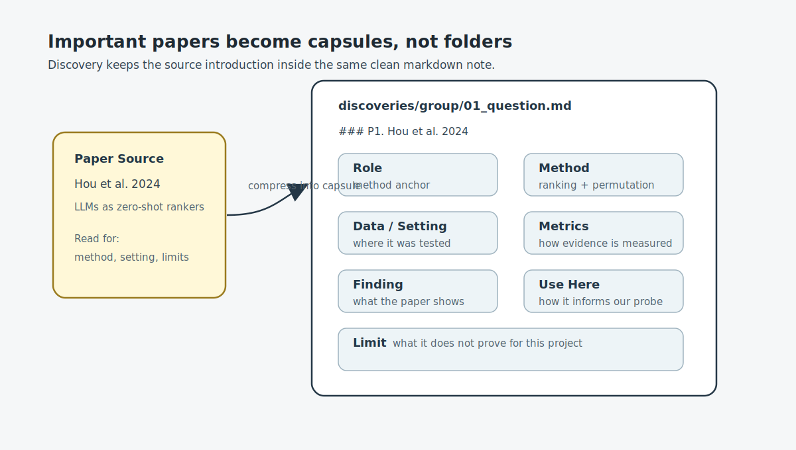

# Discovery Play

This folder explains Discovery as a short play for someone who has never used
HAI-Pipe.

It is not an execution protocol. The protocol lives in
`../haipipe-discover/SKILL.md`.

## Figures

These diagrams are lightweight play assets. They explain the role of Discovery
without adding protocol files to a real discovery run.





## Cast

**Narrative**  
The storyteller. Asks: "What story are we trying to tell?"

**Discovery**  
The outside-world scout. Asks: "What do papers, web sources, and prior work
already know?"

**Paper Source**  
A paper, report, web page, dataset, or note that may answer part of the
question.

**Probe**  
The claim gate. Asks: "Given outside evidence and our own runs, does this claim
hold?"

**Task**  
The inside-world worker. Runs code and produces metrics.

**Insight**  
The archive. Keeps only reusable knowledge after review.


## Scene 1: A Story Has a Gap

Narrative:

> I think LLMs may change which physicians patients see first.

Discovery:

> Before we run anything, let me check whether the outside world already knows
> this.

Discovery opens one lightweight note:

```text
discoveries/L01_rank-divergence-landscape/
└── 01_llm-healthcare-search-rank-divergence.md
```


## Scene 2: Discovery Reads Papers

Discovery does not dump every paper into separate folders. It keeps one clean
markdown note.

Inside the note:

```md
## Sources

| id | paper | why it matters | verification |
|----|-------|----------------|--------------|
| P1 | Hou et al. 2024 | LLMs can rank zero-shot | VERIFIED |
| P2 | Jiang et al. 2024 | LLM recs can shift provider exposure | VERIFIED |
```

For important papers, Discovery adds a paper capsule:

```md
### P1. Hou et al. 2024 — LLMs are Zero-Shot Rankers

Role: method anchor.

Method:
- Frames recommendation as conditional ranking.
- Tests LLM ranking on candidate lists.
- Permutes candidate order to test position sensitivity.

Data / Setting:
- Movie and product recommendation datasets.
- Not healthcare; not physician search.

Finding:
- LLMs can rank, but ranking depends on order and popularity.

Use here:
- Borrow the ranking and permutation method for physician reranking.

Limit:
- Does not answer whether LLMs change patient-facing physician rankings.
```


## Scene 3: Discovery Gives a Verdict

Discovery:

> I found related work. It gives methods and motivation. But it does not already
> answer our exact physician-ranking question.

The verdict is short:

```md
## Verdict

Verdict: inconclusive.

Existing literature supports this as a good empirical probe, but it does not
settle the claim. We should run a Probe comparing platform rank, Google/web
rank, constructed baseline rank, open-ended LLM recommendations, and fixed
choice LLM reranking.
```


## Scene 4: Probe Decides What to Test

Probe:

> Discovery says the claim is not already settled. Now I need internal evidence.

Probe asks Task to run:

```text
tasks/A02_baseline_rank/
tasks/B02_llm_rerank/
tasks/D01_rank_analysis/
```

Task:

> I will produce metrics: top-k overlap, rank correlation, exposure
> concentration, and hallucination/entity drift rates.


## Scene 5: Probe Closes the Claim

Probe reads:

```text
Discovery verdict  -> outside evidence
Task metrics       -> inside evidence
```

Probe:

> Now I can judge whether the claim holds.

Important: Discovery does not judge the final claim. It only says what the
outside world already knows.


## Scene 6: Insight Keeps Only What Matters

Insight:

> If this becomes reusable knowledge, I will file it later. I do not archive
> raw discovery notes automatically.

Good candidates for Insight:

- A confirmed probe result.
- A reusable method pattern.
- A vetted literature claim that future papers should cite.


## Minimal Rule

Default Discovery output should be one markdown file:

```text
discoveries/<group>/<NN_slug>.md
```

Use a folder only when the source material is heavy:

```text
discoveries/<group>/<NN_slug>/
├── discovery.md
└── sources/
```

Most Discovery notes do not need a folder.
