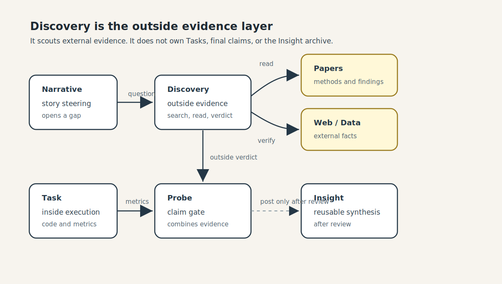
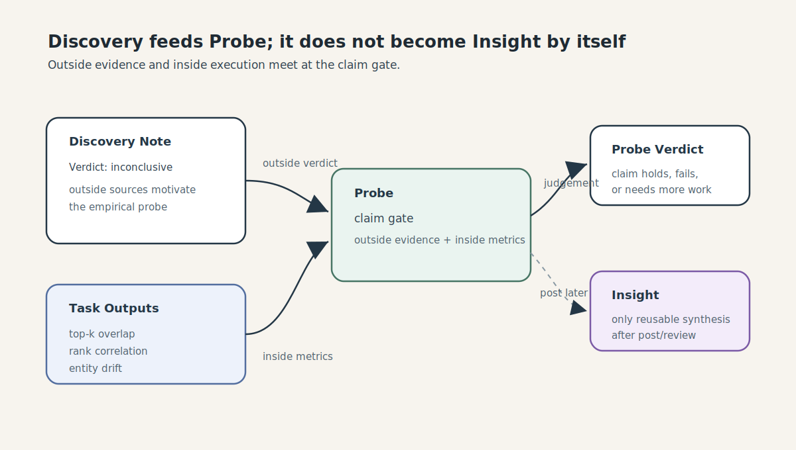

# Discovery Play

This folder explains Discovery as a short play for someone who has never used HAI-Pipe.

It is not an execution protocol. The protocol lives in `../haipipe-discovery/SKILL.md`, the canonical contract in `../haipipe-discovery/ref/lifecycle-map.md`.

## The one-minute model

A discovery is one research topic = one folder, a sibling of a task-folder. It runs the same lifecycle as a task: **Plan -> Build(optional) -> Execute -> Report**. What makes a folder a *kind* is its **type**, named by one Chinese character:

```
搜  source    search + read source material   -> sources.md + notes.md   (the reusable evidence base)
析  analyze    judge a claim or map a field     -> verdict.md (判, to a probe) / landscape.md (综, to a paper)
创  idea       propose new claims               -> ideas.md   (to a probe-open / paper-seed)
```

Two axes: the lifecycle (English, the steps) and the type (Chinese, the job). Search and read are not separate folders; they are the front of every folder's Execute.

## Figures

Lightweight play assets that explain the role of Discovery without adding protocol files to a real run.






## Cast

**Paper**
The storyteller. Asks: "What story are we trying to tell?"

**Discovery**
The outside-world scout. Asks: "What do papers, web sources, and prior work already know?"

**Paper Source**
A paper, report, web page, dataset, or note that may answer part of the question.

**Probe**
The claim gate. Asks: "Given outside evidence and our own runs, does this claim hold?"

**Task**
The inside-world worker. Runs code and produces metrics.

**Insight**
The archive. Keeps only reusable knowledge after review.

## Scene 1: A Story Has a Gap

Paper:

> I think LLMs may change which physicians patients see first.

Discovery:

> Before we run anything, let me map what the outside world already knows.

"Map a field" is an **析** question that ends in a map (综), so Discovery opens a 析 folder:

```text
discoveries/L01_rank-divergence-landscape/
└── 01_llm-healthcare-search-rank-divergence/     (type: 析, role: landscape_review)
    ├── discovery.yaml      Plan: type + question + sources
    ├── sources.md          搜 work product
    ├── notes.md            搜 work product
    └── landscape.md        综 terminal: the map
```

(If the question were "does this exact claim already exist?", it would be a **判** judge ending in `verdict.md` for a probe instead.)

## Scene 2: Discovery Gathers and Reads (搜, inside Execute)

Discovery does not dump every paper into a separate folder. It keeps one clean `sources.md`, then reads into `notes.md`.

```md
## Sources

| id | paper | why it matters | verification |
|----|-------|----------------|--------------|
| P1 | Hou et al. 2024 | LLMs can rank zero-shot | VERIFIED |
| P2 | Jiang et al. 2024 | LLM recs can shift provider exposure | VERIFIED |
```

For an important paper, Discovery adds a capsule in `notes.md`:

```md
### P1. Hou et al. 2024: LLMs are Zero-Shot Rankers

Role: method anchor.

Method:
- Frames recommendation as conditional ranking.
- Tests LLM ranking on candidate lists.
- Permutes candidate order to test position sensitivity.

Data / Setting:
- Movie and product recommendation datasets.
- Not healthcare; not physician search.

Finding:
- LLMs can rank, but ranking depends on order and popularity.

Use here:
- Borrow the ranking and permutation method for physician reranking.

Limit:
- Does not answer whether LLMs change patient-facing physician rankings.
```

## Scene 3: Discovery Analyzes (析): a Map, Not a Yes/No

Because this was a "map the field" question, the terminal is a landscape (综), not a verdict:

```md
# Landscape: LLM rank divergence in physician search
outcome: mapped
confidence: medium

## Approaches
- Zero-shot LLM ranking ........ Hou et al. 2024
- Recommendation exposure shift  Jiang et al. 2024

## Gaps
- No work measures whether LLMs change patient-facing physician rankings.

## References (full, verified)
1. ...
```

Discovery:

> The field gives methods and motivation, but it does not settle our exact physician-ranking question. That gap is the opening for a Probe.

## Scene 4: Probe Decides What to Test

Probe:

> Discovery mapped the field and found the claim is not already settled. Now I need internal evidence.

Probe asks Task to run:

```text
tasks/A02_baseline_rank/
tasks/B02_llm_rerank/
tasks/D01_rank_analysis/
```

Task:

> I will produce metrics: top-k overlap, rank correlation, exposure concentration, and hallucination/entity drift rates.

## Scene 5: Probe Closes the Claim

Probe reads:

```text
Discovery output  -> outside evidence (landscape / verdict)
Task metrics      -> inside evidence
```

Probe:

> Now I can judge whether the claim holds.

Important: Discovery does not judge the final claim. It only says what the outside world already knows. A **判** verdict is the closest Discovery comes, and even that is evidence for the Probe, not the Probe's decision.

## Scene 6: Insight Keeps Only What Matters

Insight:

> If this becomes reusable knowledge, I will file it later. I do not archive raw discovery notes automatically.

Good candidates for Insight:

- A confirmed probe result.
- A reusable method pattern.
- A vetted literature claim that future papers should cite.

## Minimal Rule

A discovery is one folder per topic. The type decides the terminal file:

```text
discoveries/<group>/<NN_slug>/
├── discovery.yaml      type: 搜 | 析 | 创
├── sources.md          搜 work
├── notes.md            搜 work
└── verdict.md | landscape.md | ideas.md      terminal, by type
```

Heavy source artifacts (PDFs, snapshots) go in an optional `sources/` subfolder. Most discoveries do not need it. Search and read are not their own folders; they are the front of any folder's Execute.
