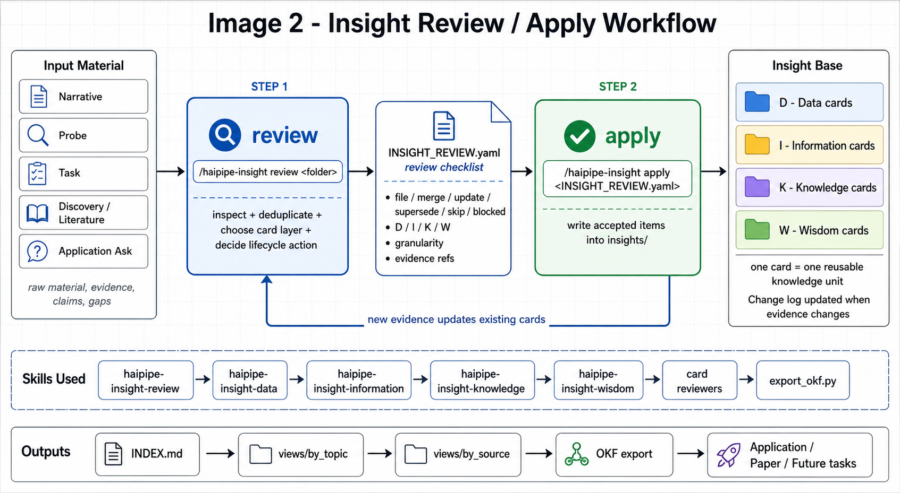

# Workflow Image

This is the one-picture version of the insight workflow.



Read it left to right:

```text
input material -> review -> INSIGHT_REVIEW.yaml -> apply -> DIKW cards
```

## What The Image Is Saying

Input material can come from:

- narrative
- probe
- task
- discovery / literature
- application ask

The review step asks:

```text
What is worth keeping as permanent project memory?
```

It creates:

```text
INSIGHT_REVIEW.yaml
```

That file is a checklist. It says which candidates should be filed, merged,
updated, superseded, skipped, or blocked.

The apply step writes accepted items into:

```text
insights/D_data/
insights/I_information/
insights/K_knowledge/
insights/W_wisdom/
```

The bottom row shows the skills and outputs involved:

- `haipipe-insight-review`
- `haipipe-insight-data`
- `haipipe-insight-information`
- `haipipe-insight-knowledge`
- `haipipe-insight-wisdom`
- card reviewers
- `INDEX.md`
- `views/`
- OKF export

The feedback arrow means new evidence can update existing cards. Cards are not
deleted casually; they are merged, updated, or superseded with a change log.
