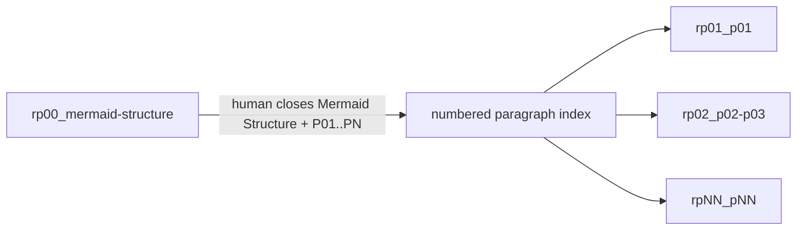

# Haipipe-page: ownership and workflow
state: 🟡 Content adopted; Web and LaTeX built; Word DOCX built; Word PDF twin unavailable; independent CHECK pending
owner: Codex

## Opening

Haipipe-page turns one document into a continuing workspace: its own source, readable Page, planning records, and delivery files.
This Page explains how to create and revise that workspace, how its plugins use the same files, and how Board can organize it without owning its content.

**Covered elsewhere**: Board group descriptions and ordering belong to haipipe-board; plugin implementation details belong to each plugin's own skill.

## Content

### 1 · Page ownership

**Division map**: editable sources and generated delivery in one Page Folder.

```text
Page Folder
├── page.toml         source registration
├── Page.md           Opening · Content · Aims
├── outline/          plan · context · evidence
└── delivery/web/     generated reading site
```

#### 1.1 · Source and delivery
(Identify the files to change and the files to rebuild.)
A Page Folder keeps everything needed to understand, change, and deliver one Page in one place. <!-- realizes: C1.P1.B1 -->
It can hold the Markdown source, code, figures, evidence, Runs and Results, and generated web, LaTeX, and Word files. <!-- realizes: C1.P1.B1 -->
Studio is where people brainstorm for the Page. <!-- realizes: C1.P1.B1 -->
Studio Chat keeps the conversation, while Studio Draw turns ideas into visual sketches. <!-- realizes: C1.P1.B1 -->
The Markdown source uses the same stem as the folder: haipipe-page-guide/ corresponds to haipipe-page-guide.md. <!-- realizes: C1.P1.B2 -->
Each delivery file is generated from that Markdown source instead of maintained as a separate source. <!-- realizes: C1.P1.B3 -->
The earlier HTML draft is kept only as material and does not control this Page or its outputs. <!-- realizes: C1.P1.B3 -->

### 2 · Board and plugins

**Division map**: Board navigation and plugin workspaces share the Page's sources.

```text
Board membership ──▶ Page Face
                       │
                 Page Folder
                 ├── Outline   planning and evidence
                 ├── Studio    chat and drawing
                 ├── Runs
                 │   ├── Page Run   rpNN · feedback · Versions · Steps
                 │   └── Task Run   native id · delegated output
                 ├── Delivery  generated outputs
                 └── Folder    file inventory
```

#### 2.1 · Shared content authority
(Separate Page ownership from Board organization.)
Board supplies grouping, ordering, and navigation by registering the same Page Face. <!-- realizes: C2.P2.B1 -->
Removing that membership should leave the Page Folder and its content intact. <!-- realizes: C2.P2.B1 -->
Plugins present the Page's planning records, conversations, runs, outputs, and files through their own declared writers. <!-- realizes: C2.P2.B2 -->
A plugin is not enabled merely because a folder or a button bears its name; its surface must reach the real records and supported actions. <!-- realizes: C2.P2.B3 -->

#### 2.2 · Two Run lanes
(Keep collaborative writing history distinct from delegated output.)
A Page Run has a local identity and a Version that stores its feedback Steps. <!-- realizes: C2.P3.B1 -->
Task Runs keep their native identity and return delegated outputs, such as paragraph drafts or Discovery results, for the Page to use. <!-- realizes: C2.P3.B2 -->
The `rpNN` and Task `rNN` sequences are independent, so `rp01` and `r01` may coexist in one Page Folder. <!-- realizes: C2.P3.B3 -->
An automated CONTEXT-to-CHECK controller invocation is a Page workflow pass, not another Page Run. <!-- realizes: C2.P3.B4 -->

#### 2.3 · Proposing interaction
(Propose only the work whose durable result is human feedback.)
The Page's Runs function proposes bounded interaction goals when a person needs to shape, compare, revise, or accept the Page itself. <!-- realizes: C2.P4.B1 -->
A proposal is not yet a Run and receives no `rpNN` until the person selects or directly commissions it. <!-- realizes: C2.P4.B2 -->
A selected candidate resumes a matching open Page Run or allocates the next `rpNN` for an independent goal, and later feedback appends Steps to that Run's current Version. <!-- realizes: C2.P4.B3 -->
Code, search, data, rendering, build, Discovery, and other output-producing work remains a normal Task Run even when a later human gate reviews its Result. <!-- realizes: C2.P4.B4 -->

#### 2.4 · Mermaid Structure then paragraphs
(Close the whole-Page configuration before numbered paragraph work begins.)
The first Page Run is always `rp00_mermaid-structure`, where the person and agent iterate on the complete Mermaid argument map until the person explicitly closes it. <!-- realizes: C2.P5.B1 -->
That Mermaid Structure closure freezes the Page-global reading order as `P01`, `P02`, through `PN`, with every serial mapped to its plan address. <!-- realizes: C2.P5.B2 -->
After the Mermaid Structure closes, the Runs function creates Steps, each with a scope covering one or more of the `N` numbered paragraphs. <!-- realizes: C2.P5.B3 -->
Each selected paragraph Run uses a short identity that exposes the exact serial or contiguous range, such as `rp01_p01` or `rp02_p02-p03`; its descriptive wording stays in Goal. <!-- realizes: C2.P5.B4 -->
Different human questions or acceptance boundaries call for different Step scopes, while code, Discovery, data, rendering, and build remain normal Task Runs. <!-- realizes: C2.P5.B5 -->



### 3 · Continuing work

**Division map**: feedback changes a bounded source before delivery is refreshed.

```text
Your request
    ↓
Context and current plan
    ↓
Candidate change + feedback record
    ↓
Explicit scoped acceptance
    ↓
Adopted Content → refreshed delivery
```

#### 3.1 · Scope and acceptance
(Show how to continue work without losing prior decisions.)
A request to revise Opening sets the editing boundary; it does not authorize rewriting the rest of the Page. <!-- realizes: C3.P6.B1 -->
During planning, the Outline workspace pairs each planned point with candidate prose for discussion. <!-- realizes: C3.P6.B2 -->
A Writing Run preserves the goal and feedback history through Versions and Steps, while accepted wording is adopted into Content through the Page workflow. <!-- realizes: C3.P6.B3 -->
Those records do not imply that a browser button executes an agent, and accepting one passage does not accept the whole Page. <!-- realizes: C3.P6.B3 -->


## Aims

### A1 · Page ownership
- 🔨 A1.1 · The reader can identify the editable Page and its generated site.
  **Done when:** source selection and a current rendered Page are checked independently of Board.
  **Now:** page.toml resolves the Markdown Face; the Page CLI builds it and the standalone server renders the standard Page with its generated Outline.

### A2 · Board and plugins
- 🔨 A2.1 · Page and Board share one content authority.
  **Done when:** ownership and membership are explicit, and each claimed plugin capability has been exercised.
  **Now:** standalone Page exposes Outline, Runs, Delivery, and Folder through the same category-plugin order as Board. Runs separates Page feedback history from Task Results, including Discovery; `rp00_mermaid-structure` has closed the Mermaid Structure and `P01..P06` index, and `rp01_p01` now owns review of the first paragraph. The shared presenter is exercised in both hosts. Evidence remains inside Outline; Studio is omitted until its chat/draw backend is available. No Board membership is registered.

### A3 · Continuing work
- 🔨 A3.1 · Subsequent feedback can target the real Page records.
  **Done when:** the real Outline and source open, and supported edits are distinguished from unavailable actions.
  **Now:** `rp00_mermaid-structure` is closed at `v001/s011`; `rp01_p01` is open at `v001/s003` with the complete C1.P1 closure proposal ready for feedback. Runs preserves both interaction records read-only and does not claim that the browser itself executes the agent.

### P · Page-level
- ⬜ P1 · The Page satisfies the user's requested workflow.
  **Done when:** the user reviews the standard Page and its actual workspaces and accepts the requested scope.
  **Now:** not accepted; the earlier custom HTML is retained as an unused draft, not the current Page entry.
